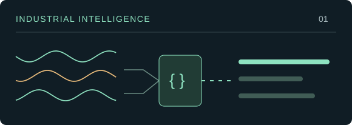
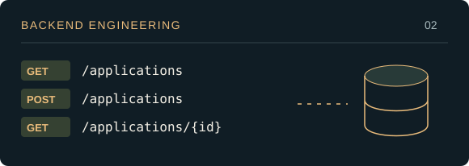
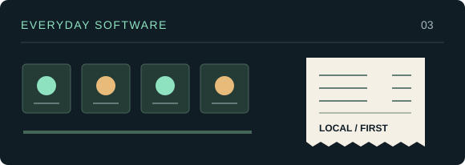
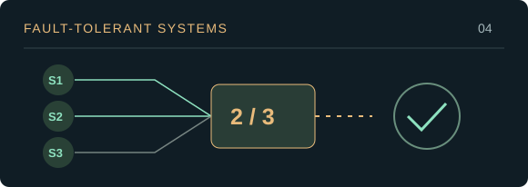

  <a href="https://hady-portfolio-seven.vercel.app/"><strong>PORTFOLIO ↗</strong></a> &nbsp; · &nbsp;
  <a href="https://www.linkedin.com/in/hady-bder/"><strong>LINKEDIN ↗</strong></a> &nbsp; · &nbsp;
  <a href="mailto:hadybder1@gmail.com"><strong>LET’S TALK ↗</strong></a>

### Software first. A wider engineering lens.

I’m Hady, a software engineer with a background in mechatronics and advanced electronic systems. I build **Java backends, full-stack applications, and tools that connect software to the physical world**.

At **Htech Co.**, I work with Java, Spring Boot, REST APIs, and databases. Alongside that, I’m developing a **CCR operator-assistance prototype** around plant alarms, reviewed knowledge, and clear troubleshooting conversations.

I like the part where an untidy real-world problem becomes something understandable—and useful.

### 01 / Selected work

<table>
<tr>
<td width="50%" valign="top">

<h3>CCR Operator Assistant</h3>

An offline prototype that matches alarms to reviewed knowledge and supports operator questions. Designed to ask for clarification when context is missing.

<code>Python</code> <code>NLP concepts</code> <code>Offline knowledge</code>

IN DEVELOPMENT · Broader retrieval is on the roadmap.

<a href="https://hady-portfolio-seven.vercel.app/#projects">Explore the project →</a>

</td>
<td width="50%" valign="top">

<h3>Job Application Tracker API</h3>

A database-backed REST API built around validation, filtering, pagination, and automated tests. A practical exercise in clear backend design.

<code>Java</code> <code>Spring Boot</code> <code>PostgreSQL</code>

BUILT · JUnit and Mockito tests.

<a href="https://hady-portfolio-seven.vercel.app/#projects">Explore the project →</a>

</td>
</tr>
<tr>
<td width="50%" valign="top">

<h3>Shanti Vikasa POS</h3>

A Windows checkout and inventory application shaped around a supermarket’s daily workflow, with local storage and receipt generation.

<code>Electron</code> <code>TypeScript</code> <code>SQLite</code>

BUILT · Practical desktop software.

<a href="https://github.com/HadyBder/shantivikasa">View repository →</a>

</td>
<td width="50%" valign="top">

<h3>Fault-Tolerant Pressure Control</h3>

Pressure regulation based on validated sensor readings. My master’s thesis explores 2-out-of-3 validation for ABB-oriented industrial pipelines.

<code>Control logic</code> <code>Sensors</code> <code>2-out-of-3</code>

MASTER’S THESIS · Implementation details are confidential.

<a href="https://hady-portfolio-seven.vercel.app/#projects">Read the overview →</a>

</td>
</tr>
</table>

### 02 / The engineering behind the work

| Area | Tools & foundations |
| :--- | :--- |
| **Backend** | Java · Spring Boot · REST APIs · Spring Data JPA · PostgreSQL |
| **Applications** | React · JavaScript / TypeScript · Electron · SQLite |
| **AI & systems** | Python · NLP concepts · Control logic · C++ · ROS 2 |
| **Engineering practice** | OOP · Data structures · Concurrency · JUnit / Mockito · Git · Docker |

### 03 / Beyond the editor

Mechatronics taught me to think across disciplines. Research in **robotic leg design** taught me to work within physical and computational constraints. Teaching robotics and tutoring data structures taught me to make difficult ideas clear.

**Academic background:** Advanced Electronic Systems at Université Bourgogne Europe, France · B.E. in Mechatronics Engineering at the Lebanese American University.

[Read the quadruped research ↗](https://soe.lau.edu.lb/research/undergraduate/a-comparative-biomechanical-analysis-and-material-constrained-se.php) &nbsp; · &nbsp; [More projects & experience ↗](https://hady-portfolio-seven.vercel.app/)

<picture>
  <source media="(prefers-color-scheme: dark)" srcset="https://raw.githubusercontent.com/HadyBder/HadyBder/output/snake-dark.svg" />
  <source media="(prefers-color-scheme: light)" srcset="https://raw.githubusercontent.com/HadyBder/HadyBder/output/snake-light.svg" />
  
</picture>

 

Interested in backend engineering, full-stack products, and thoughtful applications of AI.

