### Java · Full-stack · Applied AI

I build Java backends, full-stack applications, and software that connects to the physical world.

[Portfolio](https://hady-portfolio-seven.vercel.app/) · [LinkedIn](https://www.linkedin.com/in/hady-bder/) · [Email](mailto:hadybder1@gmail.com)

---

### What I'm working on

- **Full-stack engineering at Htech Co.** — Java, Spring Boot, REST APIs, and databases.
- **CCR operator assistant** — a developing offline workflow for matching plant alarms to reviewed knowledge and handling operator questions. The current work is a prototype; broader retrieval and operational integration are future steps.
- **Software for physical systems** — from fault-tolerant pressure control to robotics and practical desktop tools.

### Selected work

| Project | What it does | Stack / focus |
| :--- | :--- | :--- |
| [Job Application Tracker API](https://hady-portfolio-seven.vercel.app/) | REST API with validation, filtering, pagination, tests, and database persistence. | Java · Spring Boot · PostgreSQL |
| [Shanti Vikasa POS](https://github.com/HadyBder/shantivikasa) | Windows checkout and inventory app with local storage and receipts. | Electron · SQLite · TypeScript |
| [CCR Operator Assistant](https://hady-portfolio-seven.vercel.app/) | In-development alarm and incident workflow prototype using synthetic data. | Python · Structured troubleshooting |
| [Quadruped Leg Research](https://soe.lau.edu.lb/research/undergraduate/a-comparative-biomechanical-analysis-and-material-constrained-se.php) | Modeling and optimization under material and control constraints. | Python · C++ · ROS 2 |

My [portfolio](https://hady-portfolio-seven.vercel.app/) has more details, including my master's thesis on 2-out-of-3 pressure-sensor validation. Plant implementation details and private code are confidential.

### Tools I use

`Java` `Spring Boot` `REST APIs` `PostgreSQL` `React` `TypeScript` `Python` `SQLite` `Docker` `Git`

### GitHub activity

See the live contribution graph and repository activity directly below this README on [my GitHub profile](https://github.com/HadyBder). It updates with my public work and any private contributions I choose to show.

---

  <strong>Building software with systems thinking.</strong> 
  <a href="https://hady-portfolio-seven.vercel.app/">Explore the portfolio →</a>

